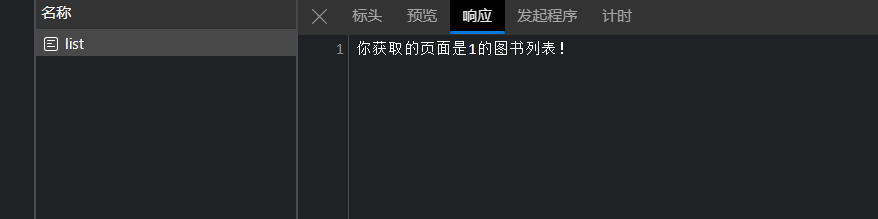
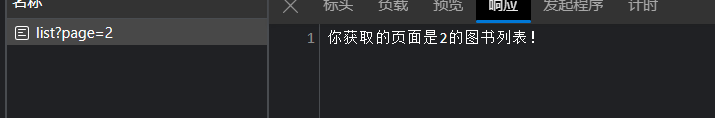
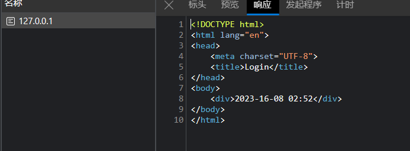
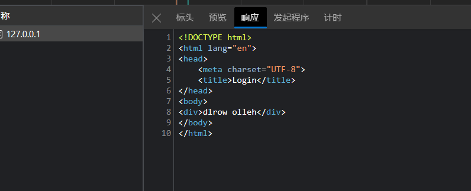
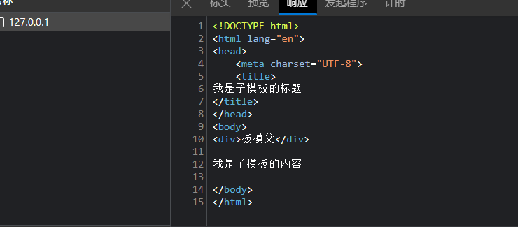

## [Flask框架](https://www.w3cschool.cn/flask/flask_routing.html)

## 安装

创建激活虚拟环境

```
pip install flask
```

## 简单demo+运行

```python
from flask import Flask

app = Flask(__name__)


@app.route("/")
def welcome():
    return "welcome to my watchlist"
```

运行flask run，报错。Flask 默认会假设你把程序存储在名为 app.py 或 wsgi.py

假设你的文件为hello.py，你要export FLASK_APP=hello.py（Linux）/ set FLASK_APP=hello.py（window）

启动调试set FLASK_DEBUG=1调试模式开启后，当程序出错，浏览器页面上会显示错误信息；代码出现变动后，程序会自动重载。

## Flask 路由

Flask中的**route()**装饰器用于将URL绑定到函数。

```python
@app.route('/hello')
def hello_world():
   return 'hello world'
```

URL **'/ hello'** 规则绑定到**hello_world()**函数。 如果用户访问**http://localhost:5000/hello** ，

**hello_world()**函数的输出将在浏览器中呈现。

application对象的**add_url_rule()**函数也可用于将URL与函数绑定

```python
def hello_world():
   return 'hello world'
app.add_url_rule('/', 'hello', hello_world)
```


```python
from flask import Flask, request

app = Flask(__name__)


@app.route('/book/list')
def book_list():
    page = request.args.get("page", default=1, type=int)
    return f"你获取的页面是{page}的图书列表！"


if __name__ == "__main__":
    app.run(debug=True, host='0.0.0.0', port='5000')
```





## Flask 变量规则

```python
from flask import Flask, render_template

app = Flask(__name__)


@app.route("/<name>")
def index(name):
    # return render_template("web1.html")
    return f'hello {name} !'


if __name__ == "__main__":
    app.add_url_rule('/', 'hello', index)
    app.run(host="127.0.0.1", port="5000", debug=True)
```


其他转换器构建规则：

```python
from flask import Flask
app = Flask(__name__)

@app.route('/blog/<int:postID>')
def show_blog(postID):
   return 'Blog Number %d' % postID

@app.route('/rev/<float:revNo>')
def revision(revNo):
   return 'Revision Number %f' % revNo

if __name__ == '__main__':
   app.run()

```

```
<int:postID> <float:revNo>
```

| 序号 |  转换器   |           描述           |
| :--: | :-------: | :----------------------: |
|  1   |  **int**  |         接受整数         |
|  2   | **float** |        对于浮点值        |
|  3   | **path ** | 接受用作目录分隔符的斜杠 |

Flask的URL规则基于**Werkzeug**的路由模块。

这确保形成的URL是唯一的，并且基于Apache规定的先例。

```python
from flask import Flask, url_for, redirect

app = Flask(__name__)


@app.route("/admin/")
def hello_admin():
    return "hello admin"


@app.route("/guest/<guest>/")
def hello_guest(guest):
    return "Hello %s as Guest" % guest


@app.route("/user/<name>/")
def hello_user(name):
    if name == 'admin':
        return redirect(url_for('hello_admin'))
    else:
        return redirect(url_for("hello_guest", guest=name))


if __name__ == "__main__":
    app.run(debug=True)
```

hello_user()**函数检查接收的参数是否与**'admin'匹配。

如果匹配，则使用**url_for()**将应用程序重定向到**hello_admin()**函数，否则重定向到将接收的参数作为guest参数传递给它的**hello_guest()**函数。

## Flask HTTP方法

| 序号 | 方法与描述                                                   |
| :--- | :----------------------------------------------------------- |
| 1    | **GET**以未加密的形式将数据发送到服务器。最常见的方法。      |
| 2    | **HEAD**和GET方法相同，但没有响应体。                        |
| 3    | **POST**用于将HTML表单数据发送到服务器。POST方法接收的数据不由服务器缓存。 |
| 4    | **PUT**用上传的内容替换目标资源的所有当前表示。              |
| 5    | **DELETE** 删除由URL给出的目标资源的所有当前表示。           |

### login.html

```html
<html>
   <body>
      <form action = "http://localhost:5000/login" method = "post">
         <p>Enter Name:</p>
         <p><input type = "text" name = "nm" /></p>
         <p><input type = "submit" value = "submit" /></p>
      </form>
   </body>
</html>
```

### test.py

```python
from flask import Flask, render_template, request, redirect, url_for

app = Flask(__name__)


@app.route('/')
def index():
    return render_template("login.html")


@app.route('/success/<name>')
def success(name):
    return 'welcome %s' % name


@app.route('/login', methods=['POST', 'GET'])
def login():
    if request.method == 'POST':
        print(1)
        user = request.form['nm']
        return redirect(url_for('success', name=user))
    else:
        print(2)
        user = request.args.get('nm')
        return redirect(url_for('success', name=user))


if __name__ == '__main__':
    app.run(debug=True)

```


### 将login.html中的post改为get


## Flask模板

### flask模板.py

```python
from flask import Flask, render_template

app = Flask(__name__)


@app.route("/")
def index():
    my_int = 18
    my_str = 'curry'
    my_list = [1, 2, 3, 4, 0]
    my_dict = {
        'name': 'wzx',
        'age': 18
    }

    return render_template('flask模板.html', my_int=my_int, my_dict=my_dict, my_str=my_str, my_array=my_list)


if __name__ == "__main__":
    app.run(debug=True)

```

### flask模板.html

```html
<!DOCTYPE html>
<html lang="en">
<head>
  <meta charset="UTF-8">
  <title>Title</title>
</head>
<body>
  我的模板html内容
  <br />{{ my_str }}
  <br />{{ my_int }}
  <br />{{ my_array }}
  <br />{{ my_dict }}
</body>
</html>
```

## Flask静态

## Flask静态.py

```python
from flask import Flask, render_template

app = Flask(__name__)


@app.route("/")
def index():
    return render_template("flask静态.html")


if __name__ == '__main__':
    app.run(debug=True)
```

### Flask静态.html

要放在templates文件夹里面

```html
<html>

   <head>
      <script type = "text/javascript"
         src = "{{ url_for('static', filename = 'hello.js') }}" ></script>
   </head>

   <body>
      <input type = "button" onclick = "sayHello()" value = "Say Hello" />
   </body>

</html>
```

这段代码是一个简单的 HTML 页面，它引入了一个名为 "hello.js" 的 JavaScript 文件，并在页面中添加了一个按钮。当按钮被点击时，调用了一个名为 "sayHello()" 的函数。

在这段代码中，首先在 `<head>` 标签中通过 `<script>` 标签引入了外部的 JavaScript 文件。引用语法 `{{ url_for('static', filename = 'hello.js') }}` 是flask的语法，用来动态地生成 "hello.js" 文件的 URL。

在 `<body>` 标签中，添加了一个 `<input>` 元素，它的类型为按钮（`type = "button"`）。按钮上显示的文本为 "Say Hello"。

当按钮被点击时，触发了 `onclick` 事件，调用了 JavaScript 中的 `sayHello()` 函数。然而，在代码中没有显示定义这个函数，需要在 "hello.js" 文件中找到该函数的实现。

### hello.js

hello.js要放在static文件夹里面

```javascript
function sayHello() {
   alert("Hello World")
}
```


点击后，执行hello.js,出现


## Flask Request对象

### Flask 将表单数据发送到模板

#### index.html

```html
<form action="http://localhost:5000/result" method="POST">
    <p>Name <input type="text" name="Name"/></p>
    <p>Physics <input type="text" name="Physics"/></p>
    <p>Chemistry <input type="text" name="chemistry"/></p>
    <p>Maths <input type="text" name="Mathematics"/></p>
    <p><input type="submit" value="submit"/></p>
</form>

```

#### result.html

```html
<!doctype html>
  <table border = 1>
     
    <tr>
       <th> {{ key }} </th>
       <td> {{ value }}</td>
    </tr>
 
</table>
```

这段代码是一个简单的HTML模板，它用于展示一个由键值对组成的result字典的数据。在HTML中，使用了一个表格（table）来展示数据。

循环结构``用于遍历result字典中的每个键值对。在每一次迭代中，通过`<tr>`标签创建一个新的表格行。

`<th> {{ key }} </th>`用于创建表头（表格的第一列），显示当前键值对的键。

`<td> {{ value }}</td>`用于创建单元格（表格的其他列），显示当前键值对的值。

循环结构的结束标签``用于表示循环的结束。

#### 1.py

```python
from flask import Flask, render_template, request

app = Flask(__name__)


@app.route("/")
def student():
    return render_template('index.html')


@app.route("/result/", methods=['POST', 'GET'])
# 记得在/result后面加/，呜呜呜，踩坑了
def result():
    if request.method == "post":
        result = request.form
        return render_template("result.html", result)


if __name__ == "__main__":
    app.run(debug=True)
```


submit之后：


### Flask Cookies

Cookie以文本文件的形式存储在客户端的计算机上。其目的是记住和跟踪与客户使用相关的数据，以获得更好的访问者体验和网站统计信息。

#### 1.py

```python
from flask import Flask, make_response, request  # 注意需导入 make_response

app = Flask(__name__)


@app.route("/set_cookies/")
def set_cookie():
    # 设置cookie
    resp = make_response("success")
    resp.set_cookie("w3cshool", "w3cshool", max_age=3600)
    return resp


@app.route("/get_cookies/")
def get_cookie():
    # 获取cookie
    cookie_1 = request.cookies.get("w3cshool")  # 获取名字为Itcast_1对应cookie的值
    return cookie_1


@app.route("/delete_cookies/")
def delete_cookie():
    # 让cookie过期
    resp = make_response("del success")
    resp.delete_cookie("w3cshool")

    return resp


if __name__ == '__main__':
    app.run(debug=True)

```

#### 关于make_response

`make_response`函数是Flask框架中用于创建HTTP响应对象的函数。你可以使用它自定义和控制响应的各个方面，例如设置状态码、添加头部信息、设置Cookie等。下面是一个使用`make_response`函数的简单示例和说明：

首先，导入`make_response`函数：

```python
from flask import make_response
```

然后，在你的路由函数中使用`make_response`函数来创建响应对象：

```python
@app.route('/example')
def example_route():
    response = make_response('This is an example response')
    # 添加其他响应设置
    return response
```

你可以将字符串作为第一个参数传递给`make_response`函数，该字符串将作为响应的主体内容。

然后，你可以对响应对象进行其他设置。例如，你可以设置响应的状态码、添加头部信息、设置Cookie等。以下是一些示例：

- 设置状态码：

```python
response = make_response('This is an example response')
response.status_code = 200
```

- 添加头部信息：

```python
response = make_response('This is an example response')
response.headers['Content-Type'] = 'application/json'
```

- 设置Cookie：

```python
response = make_response('This is an example response')
response.set_cookie('key', 'value')
```

最后，在路由函数的最后，返回响应对象：

```python
return response
```

完整的示例代码如下：

```python
from flask import Flask, make_response

app = Flask(__name__)

@app.route('/example')
def example_route():
    response = make_response('This is an example response')
    response.status_code = 200
    response.headers['Content-Type'] = 'application/json'
    response.set_cookie('key', 'value')
    return response

if __name__ == '__main__':
    app.run()
```

通过使用`make_response`函数，你可以轻松创建自定义的HTTP响应对象，并对其进行灵活的设置。

#### 运行结果：

##### set_cookies


##### get_cookies


##### delete_cookies

****

##### 再一次执行get_cookies，cookie已经被删除


### Flask 会话

与Cookie不同，**Session（会话）**数据存储在服务器上。会话是客户端登录到服务器并注销服务器的时间间隔。需要在该会话中保存的数据会存储在服务器上的临时目录中。

为每个客户端的会话分配**会话ID**。会话数据存储在cookie的顶部，服务器以加密方式对其进行签名。对于此加密，Flask应用程序需要一个定义的**SECRET_KEY**。

Session对象也是一个字典对象，包含会话变量和关联值的键值对。

#### 1.py

```python
from flask import render_template

from flask import make_response

from flask import Flask, session, redirect, url_for, escape, request

app = Flask(__name__)

app.secret_key = 'fkdjsafjdkfdlkjfadskjfadskljdsfklj'


@app.route('/')
def index():
    if 'username' in session:
        username = session['username']

        return '登录用户名是:' + username + '<br>' + \
 \
            "<b><a href = '/logout'>点击这里注销</a></b>"

    return "您暂未登录， <br><a href = '/login'></b>" + \
 \
        "点击这里登录</b></a>"


@app.route('/login', methods=['GET', 'POST'])
def login():
    if request.method == 'POST':
        session['username'] = request.form['username']

        return redirect(url_for('index'))

    return '''

   <form action = "" method = "post">

      <p><input type="text" name="username"/></p>

      <p><input type="submit" value ="登录"/></p>

   </form>

   '''


@app.route('/logout')
def logout():
    # remove the username from the session if it is there

    session.pop('username', None)
    # 如果键username不存在于会话中，pop()函数会返回None，而不是引发异常。
    # 通过设置None作为第二个参数，我们能够在键不存在时得到一个默认的返回值。

    return redirect(url_for('index'))


if __name__ == '__main__':
    app.run(debug=True)
```

`app.secret_key`是Flask应用对象的属性，用于设置应用的密钥。

密钥在Flask应用中起着非常重要的作用，它用于加密会话数据和其他敏感信息。具体来说，密钥被用于以下几个方面：

1. 加密会话数据：Flask使用密钥对会话数据进行加密，以确保会话中的敏感信息在传输过程中不被窃取或篡改。
2. 生成安全令牌：密钥被用于生成令牌，以验证用户请求的真实性。例如，在重置密码或修改账户信息等场景中，应用可以生成一个令牌，并将该令牌保存在URL中或通过其他方式传递给用户。当用户使用该令牌访问特定页面时，应用可以通过比对令牌和密钥来确保令牌的有效性和真实性。
3. 加密cookies：Flask使用密钥对cookies中存储的敏感信息进行加密，以防止信息被篡改或窃取。


#### /login


#### /logout


## Flask 重定向和错误

#### redirect

Flask.redirect(location, statuscode, response)

- **location**参数是要重定向的URL，可以是相对URL（例如`'/new-url'`）或绝对URL（例如`'http://example.com/new-url'`）。
- **statuscode**参数是可选的，用于指定重定向的HTTP状态码，默认为`302`（临时重定向）。
  - HTTP_300_MULTIPLE_CHOICES
  - HTTP_301_MOVED_PERMANENTLY
  - HTTP_302_FOUND
  - HTTP_303_SEE_OTHER
  - HTTP_304_NOT_MODIFIED
  - HTTP_305_USE_PROXY
  - HTTP_306_RESERVED
  - HTTP_307_TEMPORARY_REDIRECT

- **response**参数用于实例化响应。

#### abort

abort(status_code, error_message=None)

- `status_code`

  参数是一个整数，用于指定要返回的 HTTP 错误码。常见的一些错误码包括：

  - **400** - 用于错误请求
  - **401** - 用于未身份验证的
  - **403** - Forbidden
  - **404** - 未找到
  - **406** - 表示不接受
  - **415** - 用于不支持的媒体类型
  - **429** - 请求过多
  - **500**：服务器内部错误

- `error_message` 参数是一个可选的字符串，用于在返回的错误响应中提供详细的错误信息。

eg: abort(404, "User not found")

## Flask 消息闪现

### py

```python
from flask import Flask, flash, redirect, render_template, request, url_for

app = Flask(__name__)
app.secret_key = 'helloasdaasdkjkbkdfkajkhf'


@app.route("/")
def index():
    return render_template('index.html')


@app.route('/login', methods=['GET', 'POST'])
def login():
    error = None

    if request.method == 'POST':
        if request.form['username'] != 'admin' or request.form['password'] != 'admin':
            error = 'Invalid username or password. Please try again!'
        else:
            flash('You were successfully logged in', category='info')
            return redirect(url_for('index'))
    return render_template('login.html', error=error)


if __name__ == '__main__':
    app.run(debug=True)
```

### login.html

```html
<!DOCTYPE html>
<html lang="en">
<head>
    <meta charset="UTF-8">
    <title>Login</title>
</head>
<body>
    <form method = "post" action = "http://localhost:5000/login">
        <table>
            <tr>
                <td>Username</td>
                <td><input type = 'username' name = 'username'></td>
            </tr>
            <tr>
                <td>Password</td>
                <td><input type = 'password' name = 'password'></td>
            </tr>
            <tr>
                <td><input type = "submit" value = "Submit"></td>
            </tr>
        </table>
    </form>
    
        <p><strong>Error</strong>: {{ error }}</p>
    
</body>
</html>
```

### index.html

```
<!DOCTYPE html>
<html lang="en">
<head>
    <meta charset="UTF-8">
    <title>Index</title>
</head>
<body>
    
         
               
                    <p>{{ message }}</p>
               
         
    
<h3>Welcome!</h3>
<a href = "{{ url_for('login') }}">login</a>
</body>
</html>
```

### 运行


#### 点击login


#### 输入admin admin，然后submit


#### 输入一个错误的账号密码


## Flask过滤器

也就是jinja2，flask对jinja2进行了进一步的封装

### Flask所有过滤器

<table><thead><tr><th>过滤器</th><th>描述</th></tr></thead><tbody><tr><td>abs(value)</td><td>返回一个数值的绝对值。 例如：-1</td></tr><tr><td>default(value,default_value,boolean=false)</td><td>如果当前变量没有值，则会使用参数中的值来代替。name|default(‘xiaoli’)——如果 name 不存在，则会使用 xiaoli 来替代。boolean=False 默认是在只有这个变量为 undefined 的时候才会使用default 中的值，如果想使用 python 的形式判断是否为 false，则可以传递 boolean=true。也可以使用 or 来替换。</td></tr><tr><td>escape(value) 或 e</td><td>转义字符，会将&lt;、&gt;等符号转义成HTML中的符号。例如：content|escape 或 content|e。</td></tr><tr><td>first(value)</td><td>返回一个序列的第一个元素。names</td></tr><tr><td>format(value,*arags,**kwargs)</td><td>格式化字符串。例如以下代码：{<!-- -->{ “%s” - “%s”|format(‘Hello?’,“Foo!”) }} 将输出：Hello? - Foo!</td></tr><tr><td>last(value)</td><td>返回一个序列的最后一个元素。示例：names|last。</td></tr><tr><td>length(value)</td><td>返回一个序列或者字典的长度。示例：names|length。</td></tr><tr><td>join(value,d=’+’)</td><td>将一个序列用d这个参数的值拼接成字符串。</td></tr><tr><td>safe(value)</td><td>如果开启了全局转义，那么 safe 过滤器会将变量关掉转义。示例：content_html|safe。</td></tr><tr><td>int(value)</td><td>将值转换为 int 类型。</td></tr><tr><td>float(value)</td><td>将值转换为 float 类型。</td></tr><tr><td>lower(value)</td><td>将字符串转换为小写。</td></tr><tr><td>upper(value)</td><td>将字符串转换为小写。</td></tr><tr><td>replace(value,old,new)</td><td>替换将 old 替换为 new 的字符串。</td></tr><tr><td>truncate(value,length=255,killwords=False)</td><td>截取 length 长度的字符串。</td></tr><tr><td>striptags(value)</td><td>删除字符串中所有的 HTML 标签，如果出现多个空格，将替换成一个空格。</td></tr><tr><td>trim</td><td>截取字符串前面和后面的空白字符。</td></tr><tr><td>string(value)</td><td>将变量转换成字符串。</td></tr><tr><td>wordcount(s)</td><td>计算一个长字符串中单词的个数。</td></tr></tbody></table>

### 自定义过滤器

#### 方法1

```python
from flask import Flask, render_template
from datetime import datetime

app = Flask(__name__)


def datatime_format(value, format='%Y-%d-%m %H:%M'):
    return value.strftime(format)


app.add_template_filter(datatime_format, "datatime_format")
"""
def datatime_format(value, format='%Y-%d-%m %H:%M'):：这是一个Python函数的定义。它接受两个参数：value和format，其中value代表要格式
化的日期时间对象，format是可选的格式字符串，默认为'%Y-%d-%m %H:%M'。

return value.strftime(format)：这里使用strftime()函数来对value进行格式化。strftime()是Python标准库中的一个方法，用于将日期时间对象转换
为指定格式的字符串。

app.add_template_filter(datatime_format, "datatime_format")：这里使用add_template_filter()方法将自定义过滤器添加到Flask应用程序
中。第一个参数datatime_format是过滤器函数的名称，第二个参数"datatime_format"是你想在模板中使用的过滤器的名称。
"""


@app.route("/")
def index():
    time = datetime.now()
    return render_template("login.html", time=time)


if __name__ == "__main__":
    app.run(debug=True, host='0.0.0.0', port='5000')

```

index.html

```html
<!DOCTYPE html>
<html lang="en">
<head>
    <meta charset="UTF-8">
    <title>Login</title>
</head>
<body>
    <div>{{ time | datatime_format }}</div>
</body>
</html>
```

效果



#### 方法2

```python
from flask import Flask, render_template

app = Flask(__name__)


# 自定义过滤器
@app.template_filter('reverse')
def reverse_filter(s):
    return s[::-1]


@app.route("/")
def index():
    return render_template("index.html")


if __name__ == '__main__':
    app.run(debug=True)
```

```html
<!DOCTYPE html>
<html lang="en">
<head>
    <meta charset="UTF-8">
    <title>Login</title>
</head>
<body>
<div>{{ "hello world"|reverse }}</div>
</body>
</html>
```



## 模板继承

```python
from flask import Flask, render_template

app = Flask(__name__)


@app.template_filter('reverse')
def reverse_filter(s):
    return s[::-1]


@app.route("/")
def index():
    return render_template("index.html")


if __name__ == '__main__':
    app.run(debug=True)
```

base.html

```html
<!DOCTYPE html>
<html lang="en">
<head>
    <meta charset="UTF-8">
    <title></title>
</head>
<body>
<div>{{ "父模板"|reverse }}</div>


</body>
</html>

```

index.html

```html



我是子模板的标题



我是子模板的内容


```

响应结果

